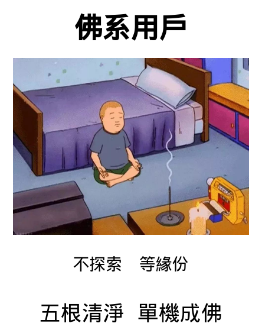
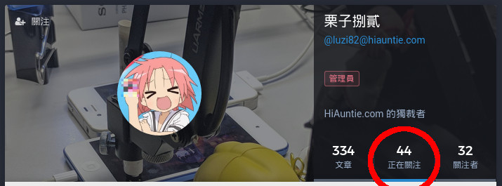

# HiAuntie.com

## 注意事項

* [站規](rule.md)
* [聲明](declaration.md)
* [系統](system.md)

## FAQ

### 有沒有好的 Mastodon 手機軟件？

其實站長自己也不太懂。[官方 Mastodon 介紹了不少軟件](https://github.com/tootsuite/documentation/blob/master/Using-Mastodon/Apps.md)，保證會選擇困難。

現時站長是使用手機內置的「加到主畫面」功能。雖然可以看 toot 寫 toot 和收通知，但分享圖片或網頁時沒有 shortcut。

 

1. 在內置的 Chrome/Safari 瀏覧器打開 HiAuntie.com。
1. 在右上角的 menu，選擇「加到主畫面」。

### 「HiAuntie」呢個名好難聽

想玩 Mastodon，除了上 HiAuntie.com 之外，還有其他選擇。用戶即使身處不同服務站，依然可以互相 follow。不同網站有不同的管理員，有不同的站規。

* [mastodon.hk](https://mastodon.hk) 另一個香港人建立的服務站
* [mastodon.social](https://mastodon.social) Mastodon 的官方服務站
* [pawoo.net](https://pawoo.net) 日本 pivix 建立的服務站，會員數比 Mastodon 官方服務站還多。很多日本畫師都是該站的會員(尤其是被 Twitter 踢出去的十八禁畫師和雜誌)。
* [drytalk.social](https://drytalk.social) 站長的朋友建立的服務站
* [joinmastodon.org](https://joinmastodon.org/) 官方的 Mastodon 入門網站，內置成千上萬的 Mastodon 連結。保證會選擇困難。
* [instances.social](https://instances.social) Mastodon 網站搜尋。選擇困難的問題可能會稍為緩和一點？

### 新手上路，我應該關注(follow)哪些人？

Mastodon 不像 Facebook / Twitter / Google+ ，它不會搜集你的資訊來介紹朋友給你。來探索有趣的關注對象吧！

#### 關注帶你玩 Mastodon 的人！

絕大部份人都是因為有朋友玩 Mastodon，才開始嘗試 Mastodon。那麼，先關注這位讓你嘗試 Mastodon 的朋友，肯定沒錯。然後順藤摸瓜，說不定會讓你找回自己的朋友圈子。

#### 關注你關注的人所關注的人！

點擊你關注的人的頭像，就可以看到他的個人檔案。再按「正關注」，就可以看到他關注了甚麼。發掘有趣的帳號和話題吧！

#### 沒有朋友，就把朋友拉過來！

呃... 當全世界還是由單一社交網站霸權的時候... 呃... 憑甚麼要大家突然轉台呢？

嗯... 不過每年總會有些時候，大家會對某個單一社交網站鼓燥吧... 「時間軸次序又被打亂啦。」「朋友的文章不知為何沒在我 timeline 出現啦。」「朋友分享的我看不見，朋友讚好的卻要顯示給我看。」「又傳私隱醜聞啦。」「那個網站要巴結某強國啦。」「我的帳號被河蟹啦！」

這個時候，就把朋友拉過來玩 Mastodon 吧！

即使現在不是時機。只要在你的社交網絡的個人介紹，貼一下 Mastodon 的帳號名。緣份一到，就會被發現吧！

#### 去時間軸尋寶吧！

「本站時間軸」顯示服務站內的公開文章。而「跨站時間軸」更會顯示其他 Mastodon 服務站的文章。看到有趣的文章的話，就不妨關注一下對方吧！

（因為世界上有太多服務站太多用戶太多文章的關係，「跨站時間軸」只會有條件地顯示其他 Mastodon 服務站中的部份文章，而不是顯示世界上所有 Mastodon 服務站的所有文章。所謂「條件」，以後有機會再解說。）

#### 某些服務站可能會有不錯的主題？

某些服務站是以某個話題設立的。翻一下他們的時間軸，可能會有意外的驚喜？

* [pawoo.net](https://pawoo.net)：日本繪圖創所網站 pivix 建立的服務站。喜歡日系插圖的朋友不妨留意一下。
* [joinmastodon.org](https://joinmastodon.org/)：官方的 Mastodon 入門網站。可以以主題找尋服務站。

## 官方賬號

* 公告：[HiAuntie 公告](https://hiauntie.com/@HiAuntie)
* 站長：[栗子捌貳](https://hiauntie.com/@luzi82)
* 系統記錄：[HiAuntie log](https://hiauntie.com/@HiAuntieVerbose)
