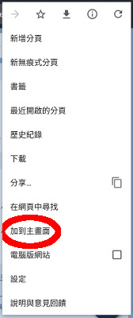
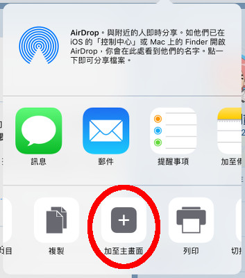

# HiAuntie.com

## 注意事項

* [站規](rule.md)
* [聲明](declaration.md)
* [系統](system.md)

## FAQ

### 有沒有好的 Mastodon 手機軟件？

其實站長自己也不太懂。[官方 Mastodon 介紹了不少軟件](https://github.com/tootsuite/documentation/blob/master/Using-Mastodon/Apps.md)，保證會選擇困難。

現時站長是使用手機內置的「加到主畫面」功能。雖然可以看 toot 寫 toot 和收通知，但分享圖片或網頁時沒有 shortcut。

 

1. 在內置的 Chrome/Safari 瀏覧器打開 HiAuntie.com。
1. 在右上角的 menu，選擇「加到主畫面」。

### 「HiAuntie」呢個名好難聽

想玩 Mastodon，除了上 HiAuntie.com 之外，還有其他選擇。用戶即使身處不同服務站﹐依然可以互相 follow。不同網站有不同的管理員，有不同的站規。

* [mastodon.hk](https://mastodon.hk) 另一個香港人建立的服務站
* [mastodon.social](https://mastodon.social) Mastodon 的官方服務站
* [pawoo.net](https://pawoo.net) 日本 pivix 建立的服務站，會員數比 Mastodon 官方服務站還多。很多日本畫師都是該站的會員(尤其是被 Twitter 踢出去的十八禁畫師和雜誌)。
* [drytalk.social](https://drytalk.social) 站長的朋友建立的服務站
* [joinmastodon.org](https://joinmastodon.org/) 官方的 Mastodon 入門網站，內置成千上萬的 Mastodon 連結。保證會選擇困難。
* [instances.social](https://instances.social) Mastodon 網站搜尋。選擇困難的問題可能會稍為緩和一點？

## 官方賬號

* 公告：[HiAuntie 公告](https://hiauntie.com/@HiAuntie)
* 站長：[栗子捌貳](https://hiauntie.com/@luzi82)
* 系統記錄：[HiAuntie log](https://hiauntie.com/@HiAuntieVerbose)
